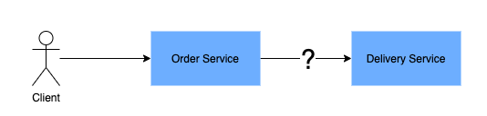
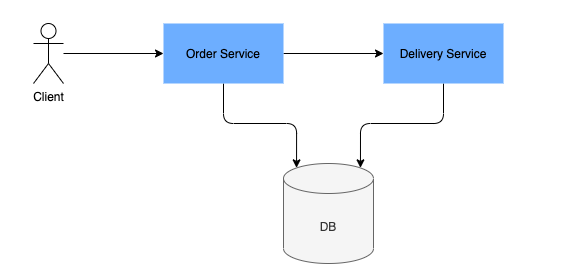
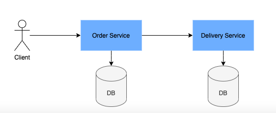

# 1.7 Практическая работа

## Задача 1. REST vs Messaging

>**Что нужно сделать**
>
>Вы проектируете систему интернет-магазина, в котором есть два приложения, Order Service и Delivery Service:
>
>Order Service отвечает за принятие заказов у клиента;
>Delivery Service рассчитывает дату доставки товара в зависимости от загрузки курьерской службы.
>Текущая архитектура отражена на диаграмме:
>
>
>
>1. Продумайте интеграцию между Order Service и Delivery Service. Сравните два подхода к интеграции — REST, синхронный подход к интеграции, и Messaging, при котором запросы отправляются асинхронно.
>
>2. Ответьте на вопросы:
>
>    * Какие плюсы и минусы у REST?
>    * Какие плюсы и минусы у Messaging?
>    * Какие факторы должны учитываться при принятии решения? *(необязательный вопрос, ответьте по желанию).

### Решение задачи

#### REST (синхронный подход к интеграции)

| Плюсы | Минусы |
|------------------------|-----------------------|
|*Простота реализации и поддержки.*   Нужно обслуживать меньше компонентов. Если нужно изменить логику обработки информации, это делается только на сервере. Вносить изменения для клиента не придется.|*Таймауты.*   Запросы обрабатываются синхронно: пока текущий обрабатывается, следующий "ждет". При большом количестве запросов могут возникать большие задержки. Также если с API сервера будет взаимодействовать много клиентов, возможны такие же проблемы.|
|*Запрос обрабатывается единожды*. Повторная обработка и возникновение дублей не происходят.|*Относительно небольшая отказоустойчивость. Сервер — единая точка отказа.*   Для повышения надежности системы нужно создавать дополнительные инстансы.|
||*Нет гарантий обработки запроса.*   Если сервер перестанет отвечать или возникнет таймаут, запрос может "потеряться"|

<!-- |*Совместимость практически с любыми платформами и языками программирования.*   Order Service и Delivery Service можно разрабатывать на разных ЯП, и они будут прекрасно взаимодействовать друг с другом.|*Таймауты.*   Запросы обрабатываются синхронно: пока текущий обрабатывается, следующий "ждет". При большом количестве запросов могут возникать большие задержки. Также если с API сервера будет взаимодействовать много клиентов, возможны такие же проблемы.|
|*"Дружит" с HTTP*   Стиль разрабатывался с прицелом на HTTP, и хорошо подходит при для работы с этим протоколом.|*Передача избыточной информации (в т.ч. из-за HATEOAS).*   В ответе на запрос может приходить "лишняя" информация (например, запрашивается номер телефона по ID клиента, а в ответ приходит еще адрес, статус и т.д.). Отсюда возможно влияние на скорость взаимодействия.|
|*Простота поддержки.*   Если нужно изменить логику обработки информации, это делается только на сервере. Вносить изменения для клиента не придется.|*Сервер — единая точка отказа.*   Для повышения надежности системы нужно создавать дополнительные инстансы.|
|*Хранение состояний и информации о сессиях с клиентом не предполагается.*   Положительно влияет на скорость обработки запросов. Можно использовать кэширование.|*Рост нагрузки на сеть при "росте" системы.*   Обусловлено, в частности HATEOAS и Stateless — каждый раз передается "много" информации|
|*Возможность реализации слоистой архитектуры.*   Между Order Service и Delivery Service можно размещать балансировщики, прокси и других "посредников", при этом изменение архитектуры системы не отразится на логике работы этих элементов|| -->

#### Messaging (запросы отправляются асинхронно)

| Плюсы | Минусы |
|------------------------|-----------------------|
|*Асинхронность и уменьшение вероятности возникновения таймаутов.*   Чтобы обработать запрос, не нужно ждать, пока выполнится предыдущий, из-за этого таймауты менее вероятны.|*Усложнение системы.*   Появляются новые элементы (в частности, брокеры сообщений), которые нужно поддерживать и обслуживать.|
|*Повышение отказоустойчивости.*   Нет единой точки отказа.|*Вероятность повторной обработки запроса.*   Пораждается гарантией доставки сообщения. Нужно предусмотреть механизм устранение дублей.|
|*Можно говорить о гарантированной обработке запроса (в случае с At least once).*   Если сервер или клиент будет какое-то время недоступным, сообщение сохранится и дойдет до адресата, как только он снова стане доступен.||

<!-- |*Асинхронность.*   Чтобы обработать запрос, не нужно ждать, пока выполнится предыдущий.|*Усложнение системы.*   Появляются новые элементы (в частности, брокеры сообщений), которые нужно поддерживать и обслуживать.|
|*Повышение отказоустойчивости.*   Нет единой точки отказа.|*Вероятность повторной обработки запроса.*    Поражается гарантией доставки сообщения. Нужно предусмотреть механизм устранение дублей.|
|*Можно говорить о гарантированной обработке запроса (в случае с At least once).*   Если сервер или клиент будет какое-то время недоступным, сообщение сохранится и дойдет до адресата, как только он снова стане доступен.||
|*Гибкость системы, масштабируемость.*   Связь между приложениями и их зависимость друг от друга ослабляется.|| -->
#### Какие факторы должны учитываться при принятии решения

1. Масштаб системы. 
2. Монолит или микросервисная архитектура.
3. Количество курьерских служб, с которыми взаимодействует Delivery Service.
4. По каким протоколам будет происходить взаимодействие  Order Service и Delivery Service.
5. Нужно отображать дату доставки в режиме онлайн, перед оформлением заказа или рассчитывать ее позже и отправлять клиенту вместе с подтверждением заказа.

## Задача 2. Database

>**Что нужно сделать**
>
>Вы определились с интеграцией между сервисами. Теперь вам нужно решить, как будут храниться данные.
>
>1. Выберите один из способов хранения данных:
>
>    * общую базу данных (БД) для этих сервисов:
>    
>    * отдельные базы данных для каждого сервиса:
>    
>
>2. Проанализируйте компромиссы в предложенных решениях, оцените преимущества и недостатки каждого подхода и ответьте на вопросы:
>
>    1. Какие плюсы и минусы у общей БД?
>    2. Какие плюсы и минусы у раздельных БД?
>    3. Какие факторы должны учитываться при принятии решения? *(необязательный вопрос, ответьте по желанию)

### Решение задачи

#### Общая БД

| Плюсы | Минусы |
|------------------------|-----------------------|
|*Легкость администрирования (условная, конечно же).*   Все данные хранятся в одном месте.|*Единая точка отказа.*   Ляжет общая БД — лягут все завязанные на нее потребители.|*Единая точка отказа.*   Ляжет общая БД — лягут все завязанные на нее потребители.|
|*Требуется меньше ресурсов.*   Условно один физический сервер или виртуальная машина.|*Относительно невысокая скорость.*   Чем больше клиентов обращается к единой БД, тем ниже скорость обработки запросов.|
|*Легче избежать дублирования данных.*   В централизованной БД это легче отслеживать.||

<!-- |*Легкость администрирования (условная, конечно же).*   Все данные хранятся в одном месте.|*Единая точка отказа.*   Ляжет общая БД — лягут все завязанные на нее потребители.|
|*Требуется меньше ресурсов.*   Условно один физический сервер или виртуальная машина.|*Замедление работы.*   Чем больше сервисов будет обращаться к БД, тем медленнее она будет работать. Придется думать над балансировщиками или in memory БД.|
|*Легче избежать дублирования данных.*   В централизованной БД это легче отслеживать|*"Неуниверсальность"*.   Одна БД может идеально подходить для одного сервиса, и не очень — для другого.| -->

### Отдельные БД

| Плюсы | Минусы |
|------------------------|-----------------------|
|*Нет единой точки отказа.*   БД одного сервиса не влияет на работу других|*Более сложная реализация и администрирование.*   Чем сложнее система, тем сложнее ее поддерживать и обслуживать|
|*Скорость работы.*   Запросы к разным БД обрабатываются быстрее, чем к одной.|*Ресурсы.*   На раздельные БД их требуется больше, чем на общую.|
||*Увеличивается вероятность появления дублей.*   Придется продумывать механизмы защиты от дублирования.|

<!-- |*Нет единой точки отказа.*   БД одного сервиса не влияет на работу других|*Возможные проблемы с синхронизацией данных.*   Нужно продумать механизм синхронизации.|
|*Адаптация под нужды конкретного сервиса.*   Например, одному сервису лучше подходит реляционная БД, второму — другой тип БД. Не придется пытаться совместить в одном месте несовместимые (ну или почти) вещи.|*Увеличивается вероятность появления дублей.*   Придется продумывать механизмы защиты от дублирования.|
||*Ресурсы.*   На раздельные БД их требуется больше, чем на общую.| -->

#### Какие факторы должны учитываться при принятии решения

1. Ресурсы.
2. Критичность возникновения дублей информации.
3. Требования по быстродействию.
4. Пожелания по отказоустойчивости.
