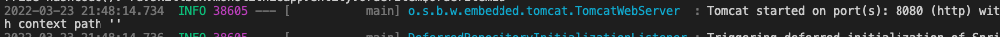
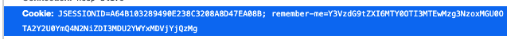
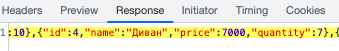
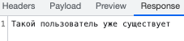
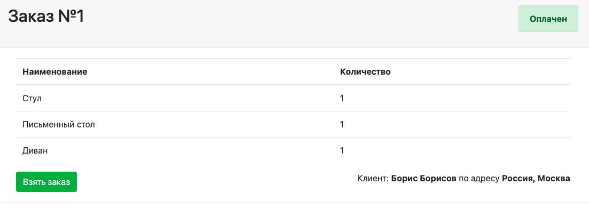
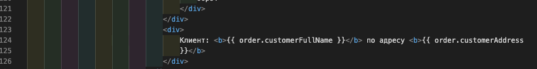

# 2.6 Практическая работа 

## Задача
>**Цель домашнего задания**
>
>Познакомиться с приложением monolithic-app
>Проанализировать функционал, архитектуру и код решения
>
>
>**Описание домашнего задания**
>
>В качестве проверки, что студент выполнил задание студенту предстоит ответить на несколько контрольных вопросов. Вопросы делятся на две категории:
>
>На анализ функционала и архитектуры, для тех кто не знаком с Java/Spring
>Вопросы по коду для тех, кто знаком Java/Spring 
>Обязательным для сдачи ДЗ является ответы на первую категорию вопросов.
>
>
>
>**Задание**
>
>В этом модуле мы познакомились с монолитным приложением, разработанным для компании 12 стульев. Исходные код и документация к приложению находятся в приложенном архиве.
>
>После того как вы распаковали архив, ознакомьтесь с документаций в файле README.MD, запустите приложение одним из способов, которые были продемонстрированы в видео.
>
>
>
>- 💡 Для запуска приложения можете использовать скомпилированный файл jar. Для этого скачайте архив, распакуйте и в >терминале находясь в папке с jar файлом выполните:
>
>```bash
>java -jar monolithic-app-1.0.0.jar
>```
>
>Если вы не знакомы с Java/Spring ответьте на следующие вопросы для сдачи этого домашнего задания:
>
>1. В каком архитектурном стиле выполнено приложение?
>2. На каком порту запускается приложение?
>3. Напишите название cookie, которая выписывается клиенту при удачной аутентификации.
>4. Укажите количество позиций “Диван”, доступных для продажи на старте приложения.
>5. Какой HTTP Status Code возвращается при попытке зарегистрировать уже существующего пользователя.
>
>
>Если вы знакомы с Java/Spring, ответьте на следующие вопросы (не обязательные для сдачи ДЗ):
>
>1. Напишите название класса, который используется для шифрования паролей.
>2. В приложении используется Random, вместо интеграции с платежными системами, укажите в процентах, как часто не будет проходить оплата по заказам?
>3. Для сокращения бойлерплейта при написании POJO используется популярная библиотека. Назовите ее.
>
>
>**Задача со звездочкой**
>
>В видео 3-го урока вы могли заметить баг в приложении, в рамках которого на экране “Доставка”  вместо имени и фамилии клиента, оплатившего заказ, дважды отображалось его имя. 
>
>Вам нужно выполнить исправление, запаковать проект в архив и прислать на проверку.

## Решение задачи

1. В каком архитектурном стиле выполнено приложение?
   -  Монолит, Layered-архитектура.

2. На каком порту запускается приложение?
   - Порт 8080.



3. Напишите название cookie, которая выписывается клиенту при удачной аутентификации.
   - `JSESSIONID`.



4. Укажите количество позиций “Диван”, доступных для продажи на старте приложения.
   - Если верить интерфейсу, то 7.


   - Если верить ответу на запрос `warehouse/items`, тоже 7.



5. Какой HTTP Status Code возвращается при попытке зарегистрировать уже существующего пользователя.
   - `409`.  Значение: "Такой пользователь уже существует".




**Задача со звездочкой**

В видео 3-го урока вы могли заметить баг в приложении, в рамках которого на экране “Доставка”  вместо имени и фамилии клиента, оплатившего заказ, дважды отображалось его имя. 

Вам нужно выполнить исправление, запаковать проект в архив и прислать на проверку.

**Решение**

У меня в архиве, который был приложен к заданию, все ОК:



Не знаю, где изначально была проблема, но как вариант, она может быть, например, на стороне фронта (см. рис. ниже), если в файле delivery.html ошибиться и неверно указать vue, что рендерить:

