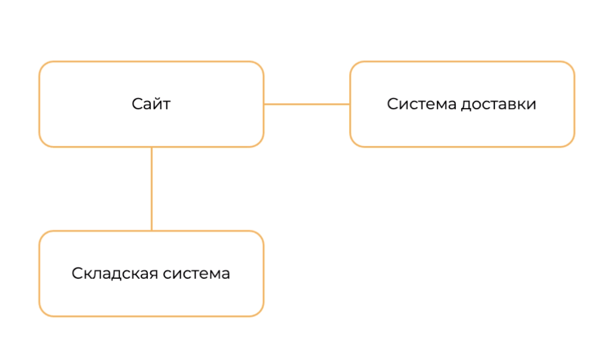

# 4.7 Практическая работа

## Задача

>**Что нужно сделать**
>Основываясь на описании владельца из домашнего задания к уроку 2:
>
>1. Выделите домены нашей системы, их будет четыре при текущем уровне декомпозиции.
>2. Выделите Core Domain (смысловое ядро).
>3. Выберите и опишите тип связи между доменами из тех, что были на уроке. Объясните логику выбора.
>4. Распишите агрегат для кухонного гарнитура и его составляющие (укажите примеры объектов значений, сущностей и бизнес-логики).
Будет не так просто, так как у вас нет возможности поговорить с доменными экспертами, но вспомните, что мы на уроке уже выделяли домены, но там не хватало одного — Core Domain. 
>
>**Видение заказчика из первого домашнего задания:**  
>
>***Что есть на текущий момент:***
>
>Сейчас у нас есть компания, которая производит мебель, есть сайт, на котором мы показываем, какая мебель у нас есть. На сайте можно оформить заказ, после чего с клиентом свяжется наш оператор, уточнит наличие изделия у нас на складе, возможно, предложит что-то ещё и подтвердит заказ, зарезервирует изделия на складе, согласует время доставки и передаст его в отдел логистики. 
>
>***К чему хочется прийти:***
>
>Мы поняли, что основная проблема в том, что проходит слишком много времени от выбора изделия и желания его купить до согласования доставки. Мы хотим, чтобы операторы реагировали на заказы быстрее и всё оформление заказа от выбора до доставки проходило бы онлайн. Чтобы пользователь после заказа мог позвонить на склад и понять, в каком статусе заказ, всё ли идёт по плану и сколько осталось ждать доставки. 
>
>Мы хотим автоматизировать все процессы оформления заказа, начиная с его оформления на сайте, формирования его на складе и доставки его системой логистики. Нам и клиенту необходима возможность посмотреть статус заказа и внести какие-то изменения в заказ, поменять место доставки или время. Хочется, чтобы в этом процессе было минимально человеческое участие.

### Решение задачи

### 1-2: Домены системы

1. **Заказы**

**Контекст**: core-domain (т.к. именно продажа мебели приносит компании прибыль). Домен взаимодействует с другими доменами из состава системы и координирует их.

**Субдомены**:

* Принятие заказа.
* Отслеживание статуса заказа.
* Контроль исполнения заказа.
* Изменение статуса заказа.
<<<<<<< HEAD
* Билинг?. (добавил сюда, т.к. в условии сказано про 4 домена, хотя по-хорошему, все, что касается расчетов, я бы вынес в отдельный домен).
* Редактирование заказа.

2. **Сайт**
=======
* Билинг?. (добавил сюда, т.к. в условии сказано про 4 домена, хотя по-хорошему, все, что касается расчетов, ф бы вынес в отдельный домен).
* Редактирование заказа.

1. **Сайт**
>>>>>>> 42d44d96b8bbcd63b32d259bd6de189c8c202216

**Контекст**: b2c, все, что относится к работе с клиентами.

**Субдомены**:

* Просмотр ассортимента.
* Личный кабинет.
* Корзина.
* Информационные материалы о продукции: инструкции, статьи.
* Обратная связь.
* Работа с заказами.

3. **Складская система**

**Контекст**: все, что относится к сборке заказов, учету продукции, формированию заказов.

**Субдомены**:

* Учет остатков.
* Заказы на пополнение склада.
* Формирование заказа.
* Выдача заказа на доставку.

4. **Логистика**

**Контекст**: b2b. Все, что относится к работе со службами доставки (b2b, т.к. своей доставки, у заказчика нет).

**Субдомены**

* Расчет времени доставки.
* Расчет стоимости доставки.
* Формирование задач/заявок для служб доставки/курьеров.
* Формирование заявок на расчет с клиентами — логистическими компаниями.

### 3: Типы связей между доменами системы, рассмотренными в ходе урока

В ходе урока рассмотрены домены:

На этой карте обозначено 2 связи:

1. **Сайт - Система доставки**. Связь Partnership. Домены должны сотрудничать в процессе эволюции своих интерфейсов, чтобы учитывать потребности обеих систем
2. **Сайт - Складская система**. Связь Customer-supplier development. Складская система выступает в роли "поставщика" информации по запросу от Сайта, через который оформляются заказы.

### 4: Агрегат для кухонного гарнитура

[filename](img/Agregate.drawio ':include :type=code')

Распишите агрегат для кухонного гарнитура и его составляющие (укажите примеры объектов значений, сущностей и бизнес-логики).
