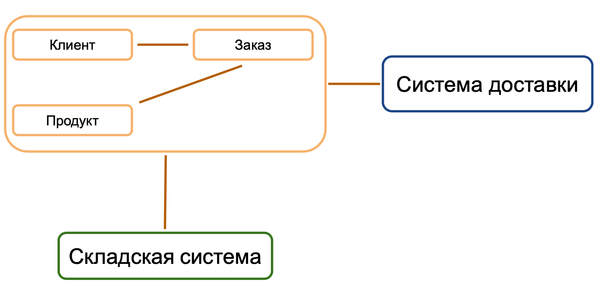

# 5.6 Практическая работа

## Задача

**Что нужно сделать**

>Исходя из того, что вам дано, — монолит, который обслуживает сайт, система доставки или складская система:
>
>1. Выделите микросервис (Core Domain), который будет отвечать за продукты.
>2. Опишите интеграции, которые необходимо реализовать, и в каких бизнес-процессах они участвуют.
>3. Опишите ФТ и НФТ к любым трём интеграциям нового сервиса в рамках бизнес-процессов. Например: добавление товара в корзину и так далее.
>4. Опишите ФТ и НФТ к новому микросервису.
>5. По желанию. Сделайте Swimline для одной интеграции.
>Как делать Swimlane-диаграммы (документация): Swimlane Diagram Basics.

## Решение задачи

1. **Выделите микросервис (Core Domain), который будет отвечать за продукты.**

В микросервис будет вынесен модуль «Продукт» сайта.

2. **Опишите интеграции, которые необходимо реализовать, и в каких бизнес-процессах они участвуют.**

|С каким модулем/сервисом происходит интеграция|В каких бизнес-процессах участвует|Примечания|
|-------------------------------------------------|----------------------------------|----------|
|Интеграция с модулем «Заказ»|1. Добавление товара в корзину. 2. Оформление заказа. 3. Сбор заказа. 4. Доставка заказа|Интеграция с модулем «Заказ» будет осуществляться через новый API.|
|Интеграция с модулем «Складская система»|1. Добавление товара в корзину. 2. Оформление заказа. 3. Сбор заказа.|Интеграция с модулем «Складская система» будет осуществляться через «Фасад» старого API. Для модуля «Продукт» будет создана собственная БД, которая будет синхронизироваться с БД модуля «Складская система» (до момента полного отказа от монолита).|

3. **Опишите ФТ и НФТ к любым трём интеграциям нового сервиса в рамках бизнес-процессов. Например: добавление товара в корзину и так далее.**

|Интеграция|Бизнес-процесс|Функциональные требования|Нефункциональные требования|
|----------|--------------|-------------------------|---------------------------|
|Интеграция с модулем «Складская система»|Добавление продукта в корзину|1. Показать клиенту ассортимент продуктов компании.  2. Показать продукты в наличии, доступные для добавления в корзину и их количество |Данные о наличии продукта на складе должны меняться не позднее чем через X секунд с момента внесения изменений в систему складского учета.  При отображении продуктов, которых нет на складе кнопка «Добавить в корзину» должна быть неактивной.  Если продукта нет в наличи, но он заказан на склад, должна отображаться информация из складской системы о планируем времени появления. Если таких сведений нет, значение планируемого времени должно быть «Скоро».|
|Интеграция с модулем «Заказ»|Добавление продукта в корзину|1. Отправить сформированную корзину в систему заказа.  2. Показать примерные сроки доставки. 3. Забронировать продукт на складе |Сведения о товарах из корзины должны начать поступать в сервис "Заказ" сразу после их добавления в корзину.  Обеспечить возможность для модуля "Продукт" получать сведения о примерных сроках доставки при просмотре товара покупателем ("Заказ" берет сведения из модуля "Система доставки")  После оформления заказа отправить в складскую систему запрос на бронирование продуктов. Если через время N оплата не получена — отправить запрос на отмену бронирования.  |
|Интеграция с модулем «Складская система»|Сбор заказа|1. Забронировать продукт на складе для заказа.  |Позиция из заказа должна резервироваться на складе в течение X секунд после подтверждения заказа. |

3. **Опишите ФТ и НФТ к новому микросервису**

|ФТ|НФТ|
|--|---|
|Пользователю должны быть видны сведения о наличии продуктов|Система должна обрабатывать не менее X заказов одновременно|
|Микросервис должен предоставлять информацию об актуальной цене|Запросы на уточнение цены нужно отправлять через каждые X при условии отображении товара на странице сайта|
|Микросервис должен бронировать товар из состава заказа на складе|Запрос на резервирование на складе должен формироваться в течение X секунд после подтверждения заказа|
